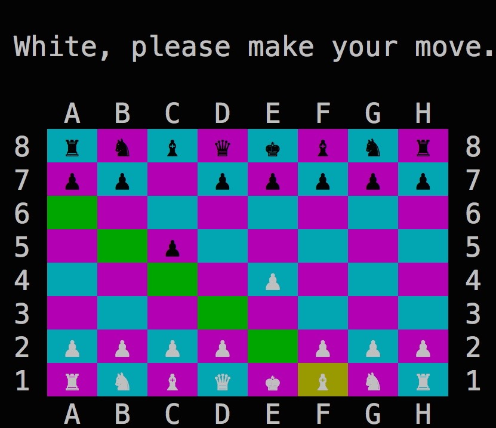

# Chess

## Description

Built with Ruby using Object Oriented principles and designed to run in the terminal.

## Features

* Graphical command line UI
* Green highlighted squares represent possible move choices per piece
* Ability to save and load games

## Usage

Be sure to `gem install colorize` to install the colorize gem.

To play a new game, run `ruby game.rb` at the command line from the root directory.

Use the arrow keys and press `ENTER` to select pieces to move.

Press `S` to save at any time, and run `ruby game.rb chess_game.yml` to load the saved game.

Press `ESC` to quit at any time.

## Pieces

The `Piece` parent class contains the functionality common to all pieces.

The individual pieces inherit from subclasses of the `Piece` class:

* Sliding pieces (Bishop/Rook/Queen)
* Stepping pieces (Knight/King)
* The pawn

## `Piece#valid_moves`

Game makes a deep_dup to validate moves without modifying the game state.
